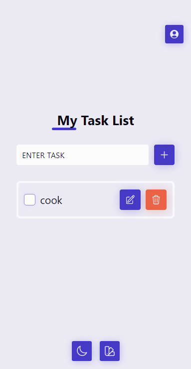
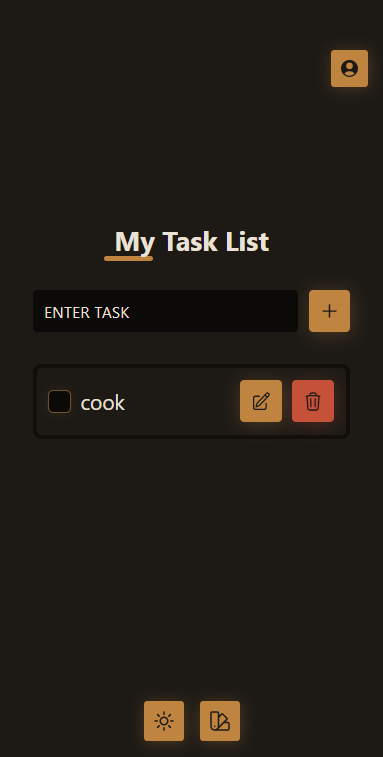
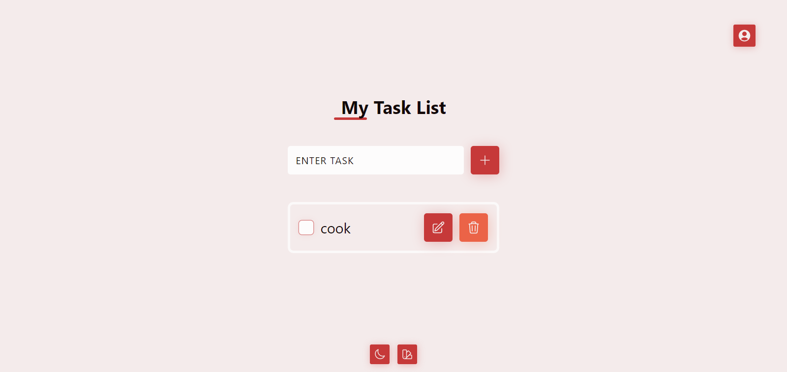
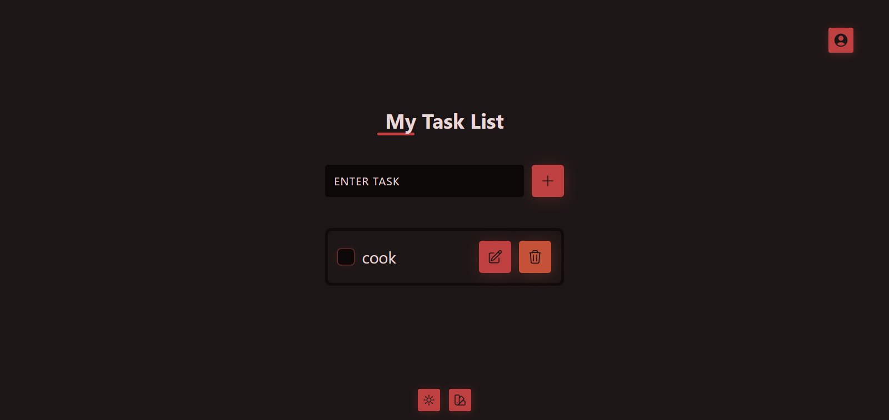

# Custom Todo App

This is a solution build along project with Chris from his youtube channel Channel, i did add a few feature giving way for the user to set a username. All data persists to localStorage!

[Chris](https://www.youtube.com/watch?v=7u2Rv4HfCYQ)

## Overview

### Screenshot

#### Mobile Device

#### Desktop

### Links

- Solution URL: [Github](https://github.com/iamenochlee/react-todo-app)
- Live Site URL: [Vercel](https://countries-project-kappa.vercel.app/)

## My process

A Custom todo app, built with ReactJs, a basic CRUD application.

### Built with

- HTML
- React JS
- Acessibility
- Mobile First Approach
- Grids
- Vite
- Custom Hooks
- React Icons / HeroIcons
- React Hooks
- Local Storage
- CSS
- CSS Modules

## Author

- enochlee

- Frontend Mentor - [@iamenochlee](https://www.frontendmentor.io/profile/iamenochlee)
- Twitter - [@iamenochlee](https://twitter.com/iamenochlee)
